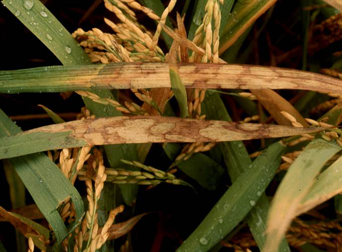
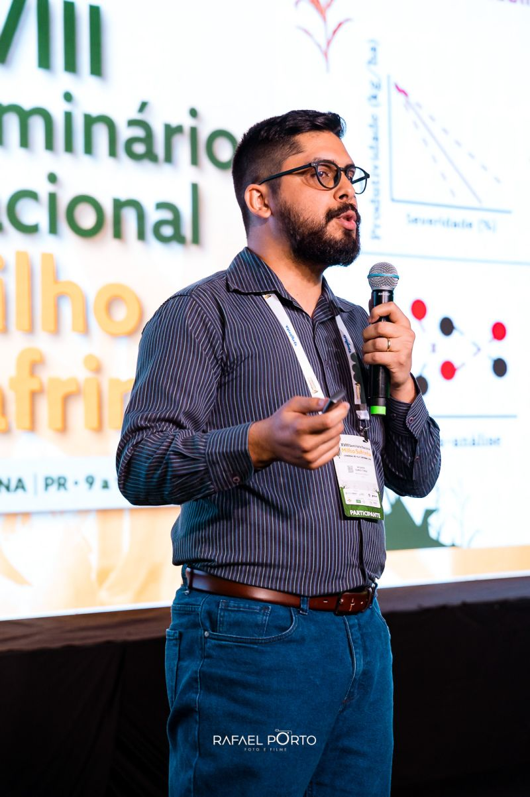

Our study aimed to assess the rice response, in terms of productivity and economic profitability, based on different management programs and rice genotypes.

A preprint version of this work has been available at [here](.).

------------------------------------------------------------------------

## Review

<div style="text-align: justify;">

Sheath blight (SB), caused by the necrotrophic fungus Rhizoctonia solani, remains one of the most destructive diseases of rice worldwide (Singh et al. 2019). The disease was first reported in Japan in 1910 (Miyake 1910) and has since been identified in rice-growing regions across Asia, Africa, Europe, and the Americas, including Bangladesh, Brazil, Myanmar, China, Taiwan, Thailand, Nigeria, India, Iran, the United Kingdom, the United States, and Vietnam (Sivalingam et al. 2006).

</div>

------------------------------------------------------------------------

## Why is this study important?

<div style="text-align: justify;">

Although several studies have estimated potential yield losses caused by the SB disease, most of these estimates were derived from experiments conducted under controlled inoculation or highly favorable conditions for disease development. As a result, reported yield loss values vary widely, ranging from 20–25% when the disease reaches the flag leaf (Mizuta 1956; Hori 1969), and as high as 50% under highly conducive environments (Uppala and Zhou 2018). Other studies have reported more moderate losses, ranging from 1.93 to 20.77% across growth stages from initial tillering to flowering (Khoshkdaman et al. 2021), or between 8 and 40% depending on genotype response (Groth 2008). This wide range of reported yield losses underscores the need for approaches that quantify empirically disease–yield relationships and associated economic insights under realistic field conditions, as demonstrated in similar frameworks developed for wheat (Ascari et al. 2021; Duffeck et al. 2019), soybean (Dalla Lana et al. 2014; Edwards-Molina et al. 2019), and maize (de Carvalho et al. 2025; Gonçalves et al. 2025).

</div>

{fig-align="center" width="100%"}
Source: LSU AgCenter

------------------------------------------------------------------------

## Who am I?

::: {style="display:flex; align-items:center; gap:20px; margin-top:20px;"}
```{=html}

```

<p style="max-width:600px;">

I'm Ricardo G. Tomaz, a Brazilian PhD Student in Plant Pathology (UFV) and I am doing my PhD Sandwich Program at LSU (EUA). I have strong expertise in crop disease epidemiology, predictive modeling, and yield-loss simulation in crops such as soybean, wheat, and maize. In addition, I have worked with remote sensing to identify and quantify important disease in rice.

</p>
:::

------------------------------------------------------------------------

## Let me know something

📧 **rtomaz\@agcenter.lsu.br**